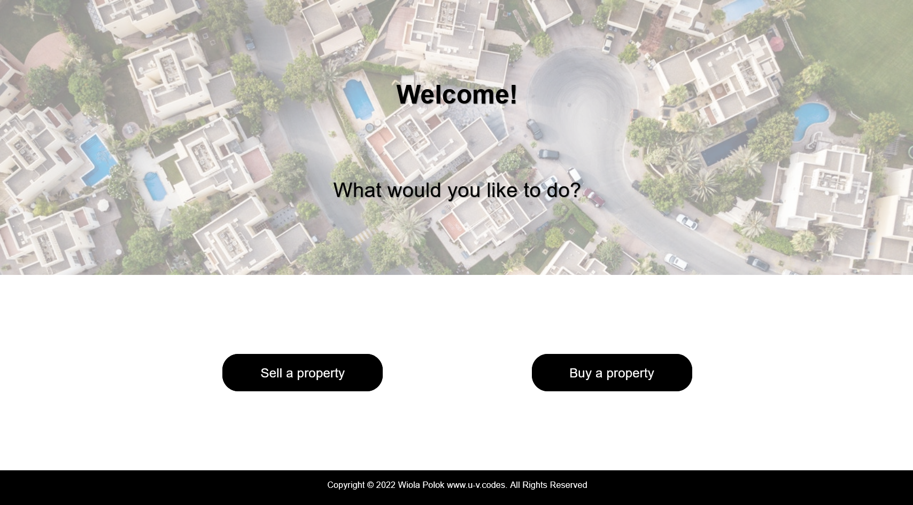
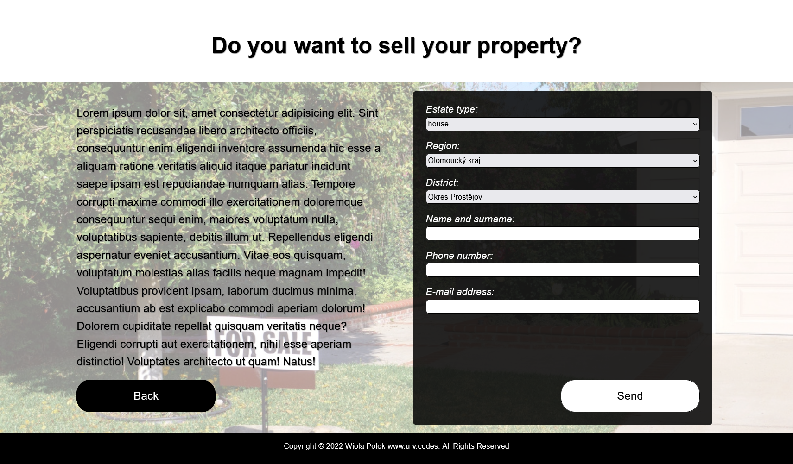
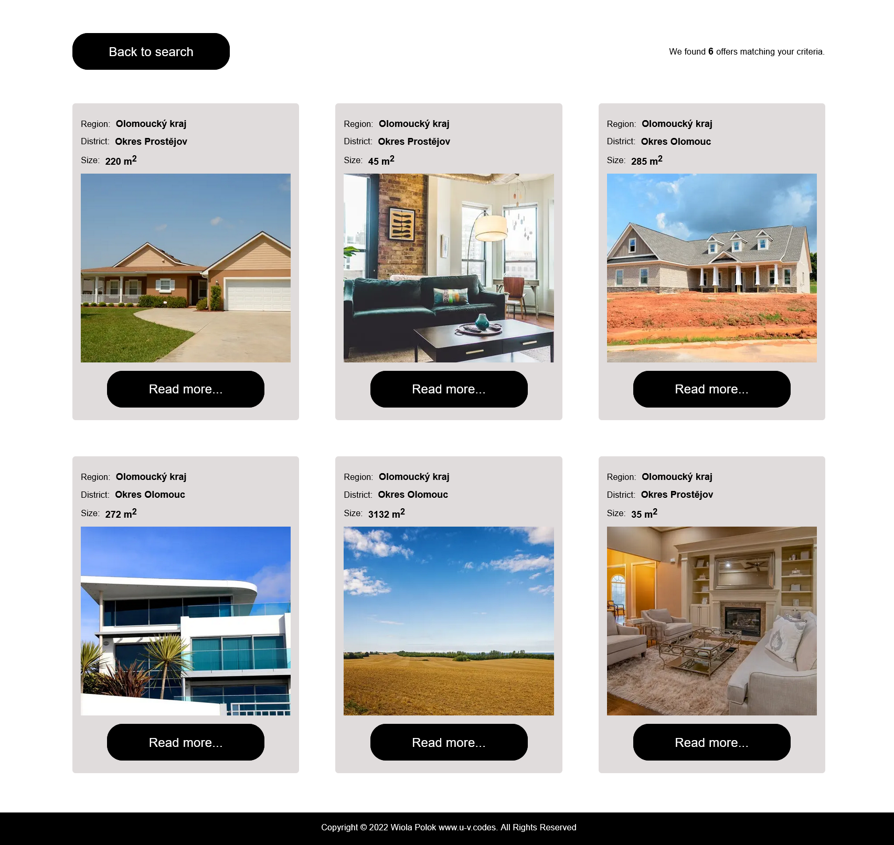
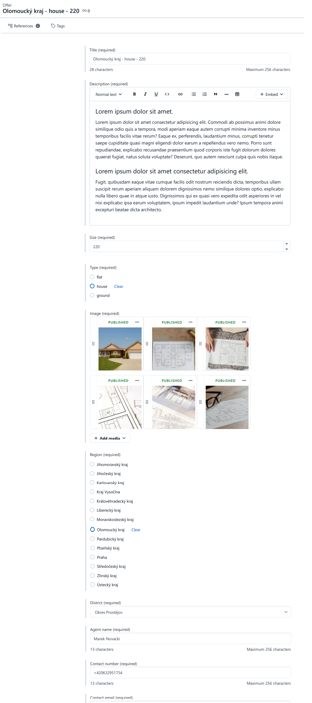

# Real Estate

> Real Estate is a website providing real estate services. It is home page of real estate agency with estate offers like flats, houses and ground.
>
> Client can:
>
> - browse available offers
> - filter offers by region, district and type
> - sellers can send a message by contact form - data is stored in Mongo DB
>
> Agent can:
>
> - add and delete offers in Contentful
>
> Project was created to practice all technologies used here.

## Live demo [_here_](https://real-estate-two-phi.vercel.app)

## Table of Contents

- [Technologies Used](#technologies-used)
- [Screenshots](#screenshots)
- [Setup](#setup)
- [Project Status](#project-status)
- [Room for Improvement](#room-for-improvement)
- [License](#license)
- [Contact](#contact)

## Technologies Used

- Next.js
- MongoDB
- Formik
- Yup
- Contentful

## Screenshots







## Setup

### Getting Started

This is a [Next.js](https://nextjs.org/) project bootstrapped with [`create-next-app`](https://github.com/vercel/next.js/tree/canary/packages/create-next-app).

First, run the development server:

```bash
npm run dev
# or
yarn dev
```

Open [http://localhost:3000](http://localhost:3000) with your browser to see the result.

You can start editing the page by modifying `pages/index.js`. The page auto-updates as you edit the file.

[API routes](https://nextjs.org/docs/api-routes/introduction) can be accessed on [http://localhost:3000/api/hello](http://localhost:3000/api/hello). This endpoint can be edited in `pages/api/hello.js`.

The `pages/api` directory is mapped to `/api/*`. Files in this directory are treated as [API routes](https://nextjs.org/docs/api-routes/introduction) instead of React pages.

## Learn More

To learn more about Next.js, take a look at the following resources:

- [Next.js Documentation](https://nextjs.org/docs) - learn about Next.js features and API.
- [Learn Next.js](https://nextjs.org/learn) - an interactive Next.js tutorial.

You can check out [the Next.js GitHub repository](https://github.com/vercel/next.js/) - your feedback and contributions are welcome!

## Deploy on Vercel

The easiest way to deploy your Next.js app is to use the [Vercel Platform](https://vercel.com/new?utm_medium=default-template&filter=next.js&utm_source=create-next-app&utm_campaign=create-next-app-readme) from the creators of Next.js.

Check out our [Next.js deployment documentation](https://nextjs.org/docs/deployment) for more details.

## Project Status

Project is: _in progress_

## Room for Improvement / work in progress

- implement Nodemail for email sending
- add admin account for browse clients' contact data (stored in database)

## License

This website was built by Wiola Polok www.u-v.codes.
Copyright @ 2022 Wiola Polok www.u-v.codes. All Rights Reserved.
You are allowed to use it for both personal and commercial use, but not to claim it as your own design.

## Contact

Created by [@Wiolinek](https://github.com/Wiolinek) - feel free to contact me!
